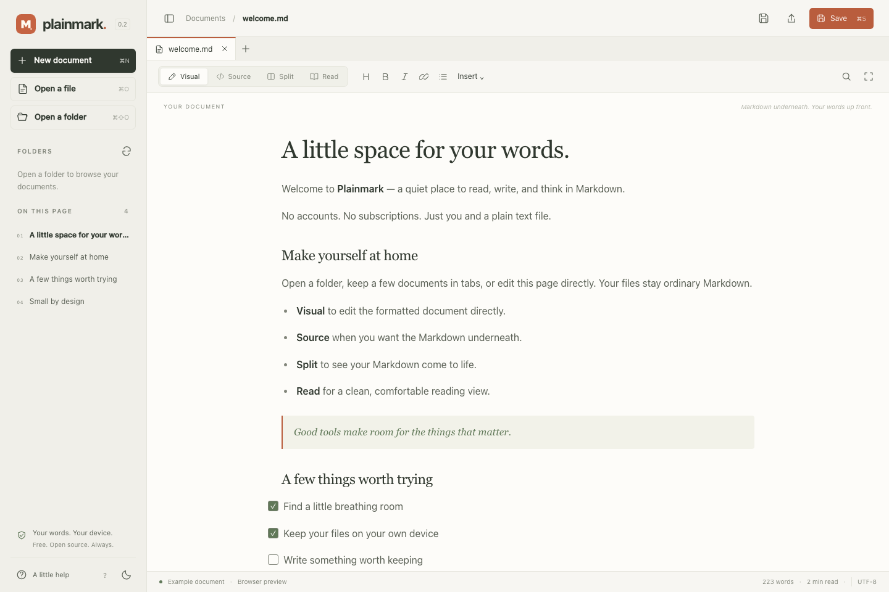

<p align="center"></p>
<h1 align="center">Plainmark</h1>
<p align="center">A little space for your words.</p>
<p align="center">A free, open-source Markdown viewer and editor for Windows, macOS, and Linux.<br>No accounts. No ads. No tracking. No paid features.</p>



## Get Plainmark

**[Visit the Plainmark website](https://markdown.eksaar.com)** · [Download the latest preview release](https://github.com/gopalasubramanium/plainmark/releases) · [Report a bug](https://github.com/gopalasubramanium/plainmark/issues) · [Contribute](CONTRIBUTING.md)

**Windows: [Get Plainmark free from Microsoft Store](https://apps.microsoft.com/detail/9pb6h8z02k0g).** The public listing is named **Plainmark Markdown Editor**, published by **Gopala Subramanium**.

Direct GitHub downloads remain **[v0.3.3](https://github.com/gopalasubramanium/plainmark/releases/tag/v0.3.3)**, a preview. Choose the installer for your computer:

| Platform | Download | Target |
| --- | --- | --- |
| Windows | Microsoft Store (recommended), or unsigned preview `.exe` | Windows 10/11, x64 |
| macOS, Apple Silicon | `aarch64.dmg` | macOS 11+ |
| macOS, Intel | `x64.dmg` | macOS 11+ |
| Linux | `.AppImage` or `.deb` | x64; built on Ubuntu 22.04 |

Windows uses WebView2, and Linux requires WebKitGTK 4.1. AppImage compatibility depends on the host distribution and its system libraries. See [Tauri’s platform prerequisites](https://v2.tauri.app/start/prerequisites/).

**v0.3.3** has Developer ID-signed, Apple-notarized Mac apps and DMGs for both architectures. The separate Windows EXE on GitHub is still unsigned; its signing application is pending. Microsoft Store is the recommended Windows installation route. Check the [Code signing policy](docs/SIGNING.md) for the exact download. You can also build directly from source below.

Mac users can also install through the [official publisher-maintained Homebrew tap](https://github.com/gopalasubramanium/homebrew-plainmark):

```sh
brew install --cask gopalasubramanium/plainmark/plainmark@preview
```

This uses the same signed and notarized Mac preview downloads, with a checksum for each architecture. Microsoft Store is live; the Mac App Store submission is awaiting review. See [distribution status](docs/DISTRIBUTION-STATUS.md).

## Your words, without the noise

- **Visual, Source, Split, Read.** Edit the formatted document directly, work with Markdown, or settle into a reading view.
- **Quick Open and note links.** Find documents by name or path; follow local Markdown links without losing unsaved tabs.
- **Folder workspaces and tabs.** Browse folders on demand, keep several documents open, and retain each tab’s editing history.
- **Mermaid and TeX math.** Locally rendered diagrams and native MathML, with no CDN or font downloads.
- **Runnable HTML.** Explicitly start a block’s scripts in an isolated preview; editing or changing tabs stops it.
- **Block scroll synchronization.** Source and preview track matching Markdown block boundaries in both directions.
- **Open with Plainmark.** Installers register `.md`, `.markdown`, and `.mdown` with the OS. Choosing Plainmark as your default remains your choice.
- **Real local files.** Open, edit, save, and save a copy using native file dialogs.
- **Markdown essentials.** Headings, tables, task lists, strikethrough, quotes, links, and fenced code.
- **A proper editor.** Markdown syntax colors, undo/redo, line numbers, find/replace, formatting shortcuts, and keyboard navigation.
- **A document outline.** Jump straight to the section you need.
- **Thoughtful safeguards.** Unsaved-change prompts, local crash recovery, atomic saves, and detection of external file edits.
- **Light and dark themes.** System fonts, balanced spacing, and no external font downloads.
- **Print and PDF.** Use the system print dialog to share a static document without app controls or creator branding.
- **Offline HTML export.** Export a self-contained reading copy with any successfully loaded local images embedded.
- **Paste or insert images.** Add a screenshot directly, or choose Image from file. Desktop attachments stay in an `assets` folder beside your note.
- **Local images.** PNG, JPEG, GIF, WebP, and sanitized SVG inside the selected workspace or document folder.

Files remain plain UTF-8 Markdown. Existing BOMs and Windows CRLF line endings are preserved on normal saves. New files use UTF-8 and LF. A file containing mixed newline styles is normalized to one style.

## Free means free

Created by **[Gopala Subramanium](https://me.sgopala.com)**. I made Plainmark because reading and writing Markdown is an everyday task. I wanted a simple tool that stays free, without ads, subscriptions, unnecessary extras, or interruptions. Useful software should leave you free to get on with your day. See [creator and contributor credits](AUTHORS.md).

The official Plainmark project is committed to being free of charge, without ads, telemetry, subscriptions, bundled offers, or premium tiers. There is no server, account system, update service, or runtime dependency on a CDN.

The code is licensed under **GPL-3.0-or-later**. You can use, study, change, and share it. Distributed derivatives must comply with the GPL’s source-sharing requirements. The license permits commercial redistribution; our free-of-charge commitment applies to official Plainmark releases. Your own documents are yours and are not covered by the app’s license. See [LICENSE](LICENSE), [the project principles](PRINCIPLES.md), and [the GNU GPL FAQ](https://www.gnu.org/licenses/gpl-faq.html#DoesTheGPLAllowMoney). The maintainer grants a narrow [Apple Store distribution permission](LICENSE-APPLE-STORE-EXCEPTION.txt) for his own code. Source stays GPL-3.0-or-later; [third-party licenses and source rights](docs/APPLE-STORE-LICENSES.md) remain separate.

## Privacy and safety

Opening a document does not send its contents anywhere. Remote Markdown images are represented by placeholders rather than fetched, and HTML receives a sanitized static preview. Scripts run only after **Run HTML** is selected. That frame has an opaque origin, no app or file access, and restrictive content rules. Normal preview output is sanitized. External links open in your browser only when clicked.

While you edit, recovery copies of unsaved tabs are stored in the app’s local webview storage. Each copy is removed when you save or deliberately discard that tab. A recovered draft opens as a copy and must be saved again. Recovery storage is not encrypted; clearing app/browser data removes it. Normal file saves are explicit, not automatic. Disable and clear recovery copies in **A little help → Privacy settings**. System spelling suggestions default to off; Run HTML can also be disabled. See [the privacy policy](PRIVACY.md) and [security boundaries](SECURITY.md).

The native backend opens files selected through native dialogs, a selected workspace, or the OS “Open with” action. It never recursively scans a workspace at startup. Local image access is confined to the selected workspace or document folder, including symlink checks. If a file changes externally, save a copy under a different name or reopen the newer version. Plainmark does not merge concurrent edits.

## Build from source

Install [Node.js 22.12+](https://nodejs.org/), [pnpm 11](https://pnpm.io/installation), a current stable [Rust toolchain](https://rustup.rs/), and the [Tauri system prerequisites](https://v2.tauri.app/start/prerequisites/) for your OS.

```sh
git clone https://github.com/gopalasubramanium/plainmark.git
cd plainmark
pnpm install --frozen-lockfile
pnpm desktop
```

Create an installer for your current OS:

```sh
pnpm desktop:build
```

Bundles are written under `src-tauri/target/release/bundle/`. GitHub Actions also builds Windows, Linux, and both Mac architectures. See [release instructions](docs/RELEASING.md).

For a browser-only development preview, use `pnpm dev`. Browsers with the File System Access API can save files in place; other browsers download a copy. Browser mode can resolve local images after you open their containing folder. HTML execution uses an in-memory endpoint in the local development/preview server; arbitrary static hosting does not provide that endpoint. It is a development preview, not an installed offline web app.

## Keyboard shortcuts

Use **Cmd** on macOS and **Ctrl** on Windows/Linux.

| Action | Shortcut |
| --- | --- |
| New / Open / Save | Mod+N / Mod+O / Mod+S |
| Open folder / Save as / Save all | Mod+Shift+O / Mod+Shift+S / Mod+Alt+S |
| Quick Open / Print or PDF | Mod+P / Mod+Shift+P |
| Follow link in Visual | Mod+click or Mod+Enter at a link |
| Close tab / Next tab | Mod+W / Ctrl+Tab |
| Bold / Italic / Link | Mod+B / Mod+I / Mod+K |
| Find and replace | Mod+F |
| Visual / Source / Split / Read | Mod+1 / Mod+2 / Mod+3 / Mod+4 |
| Focus mode | Mod+Shift+F; Esc to leave |
| Undo / Redo | Mod+Z / Mod+Shift+Z |
| Leave the editor using Tab | Esc, then Tab |

## Small by design

Plainmark uses **Tauri 2** and vanilla TypeScript. Rust owns file access, native dialogs, menus, single-instance opening, and the executable HTML protocol. The folder tree, tabs, recovery, and block mapping are maintained in this repository. ProseMirror supplies the visual editing engine; CodeMirror supplies source editing; markdown-it and DOMPurify handle parsing and sanitization; Mermaid and KaTeX handle their established languages. It uses the operating system’s web renderer instead of shipping a separate browser engine. All application assets are bundled. Build tools and test browsers are development dependencies and are not shipped with the app.

The source editor, visual editor, diagrams, and math engines load on demand. Math uses the OS renderer’s MathML support rather than shipping math fonts. Diagram and image caches are bounded; folder entries load only when expanded. No UI framework, plugin marketplace, cloud service, or background indexer is included.

Documents are limited to 5 MB, and files above 1 MB open in Source view to keep editing responsive. Up to 100 tabs can be open. A folder listing allows 2,000 visible entries and scans at most 20,000 directory entries; hidden folders, `node_modules`, and `target` are omitted. Rich rendering is bounded to 500 preview blocks, with 50,000-character diagrams and 20,000-character math expressions. HTML execution is limited to 512 KB.

Visual editing supports CommonMark text formatting, nested lists, tasks, tables, images, frontmatter, math, diagrams, and HTML blocks. Complex blocks have an **Edit** control for their source. Visual edits normalize Markdown formatting (for example, list markers and table spacing); simply switching views preserves the original source. Documents containing reference definitions, footnotes or wiki links stay in Source view to preserve that syntax. Reference links render in preview; footnote and wiki-link extensions are not implemented. Undo history is retained per tab and editor; editing in one representation resets the other representation’s history.

Quick Open reads names on demand, with limits of 250 folders, 5,000 files and 12 levels; it reports partial results when limits are reached. It does not search file contents or create a persistent index.

See [the research and improvement report](docs/RESEARCH.md) and [trusted distribution preparation](docs/SIGNING.md).

See [the feature guide](docs/FEATURES.md) for examples and boundaries.

## Tests

```sh
pnpm build
pnpm test
pnpm exec playwright install chromium webkit
pnpm test:e2e
cargo test --locked --manifest-path src-tauri/Cargo.toml
```

The suites cover visual Markdown round trips, editing in Chromium and WebKit, independent tabs and recovery, folders and SVG, math and Mermaid, HTML isolation, block synchronization, native save conflicts, UTF-8, line endings, and file-access boundaries. Automated tests do not replace manual installer checks on each supported OS.

## Contribute

Useful bug reports, accessibility improvements, translations, and small, well-considered changes are welcome. Read [CONTRIBUTING.md](CONTRIBUTING.md) first. Keep the app understandable, private, and small.

Copyright © 2026 Plainmark contributors. Distributed under the GNU General Public License, version 3 or later. Third-party libraries retain their own licenses; notices are included with desktop builds.
