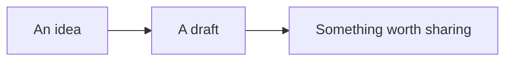

# A document that comes to life

Write **clearly**, keep your files local, and move between Visual and Source whenever you need to.

- [x] Open a folder
- [ ] Try editing this table

| Document | State |
| :--- | :--- |
| First idea | Draft |
| Something useful | Ready |

## Math

An inline expression: $E = mc^2$.

$$
\int_0^1 x^2\,dx = \frac{1}{3}
$$

## A Mermaid diagram



## Local SVG


## Interactive HTML

Choose Run HTML to try this local counter.

```html
<style>button{font:16px system-ui;padding:12px 20px;border:0;border-radius:8px;background:#bf6847;color:white}</style>
<button onclick="this.dataset.n=Number(this.dataset.n||0)+1;this.textContent='Count: '+this.dataset.n">Count: 0</button>
```
